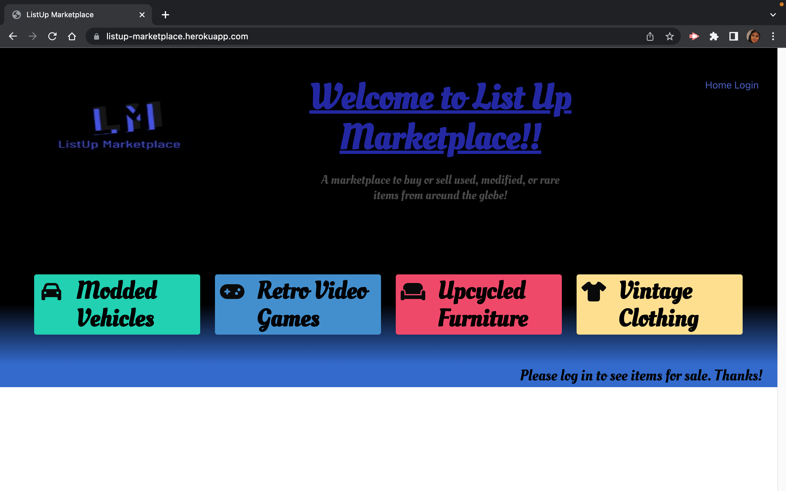

# Listup Marketplace

## Description

We built this app to provide a place for users to shop for second hand items in niche categories. Here you can find vintage clothing, modded vehicles, upcycled furniture, and/or retro gaming systems. Users must create an account and log in to see the inventory available. In a normal marketplace setting a user would have to search through thousands of listings to find a few good items that would fall into these categories. With this app that would not be an issue since we are bringing the right items to them. In building this we were able to refine our knowledge of bulma, routes and displaying images with handlebars. We hope that users will find the site to be user friendly and make buying from a second hand marketplace a bit more efficient.

## Table of Contents

- [Installation](#installation)
- [Usage](#usage)
- [Credits](#credits)
- [Technologies](#technologies)
- [License](#license)

## Installation

No installation steps are required. This application may be visited at ***https://listup-marketplace.herokuapp.com/***

## Usage

**How It Works:**
  **Steo 1:** When visiting our site at ***https://listup-marketplace.herokuapp.com/*** a user will see our homepage.
 
  **Step 2:** In order to see the categories offered a user must sign up for an account or log in to their account.
 
  **Step 3:** Once logged in a user will see all four categories offered and can now click into them to see products available. The webpage shuld look as follows.
 
  **Step 4:** Once clicked into a certain category a user should see a list of products as shown below.
 

## Credits

Alex Peckman
 **https://github.com/peckham4563**
 **Geneveve Perez**
 **https://github.com/genrp24**
 **Juan Galvan**
 **https://github.com/Juang1908**
 **Saed Cameron**
 **https://github.com/saedcameron**
 **Will Jaramillo**
 **https://github.com/willj30**

 **Wael Yasmina** ***https://www.youtube.com/watch?v=HxJzZ7fmUDQ*** For technical assistance and walkthrough of Handlebars with Node.js & Express.
 **GeeksforGeeks** ***https://www.geeksforgeeks.org/how-to-display-images-using-handlebars-in-node-js/*** For technical support and walkthrough of how to display images using handlebars in Node.js
 **Medium** ***https://javascript.plainenglish.io/server-side-image-rendering-with-express-handlebars-cb224187b276*** For technical support with server-side mage rendering with Express Handlebars.

## Technologies

1). Handlebars Templating Language**
 **https://handlebarsjs.com/guide/#what-is-handlebars**
 ****
  **2). Bulma CSS styling Framework**
 **https://bulma.io/documentation/layout/tiles/**
 ****
 **https://www.mysql.com/**
 ****
 **https://devcenter.heroku.com/**
 ****
 **https://nodejs.org/en/**
 ****

## License

Please refer to the license in the repo.**
 **https://github.com/willj30/list-up-marketplace**